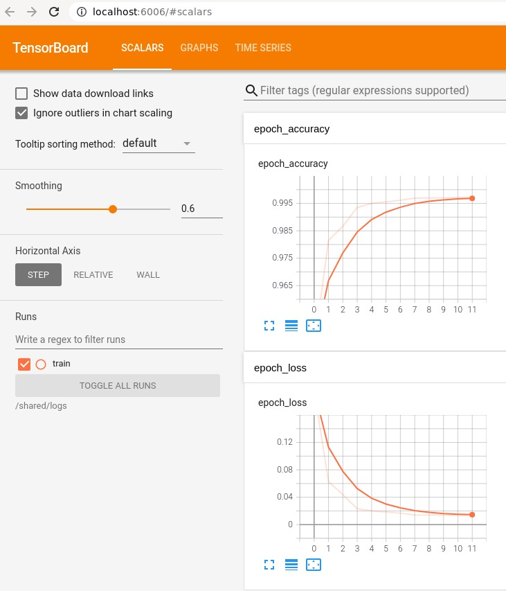
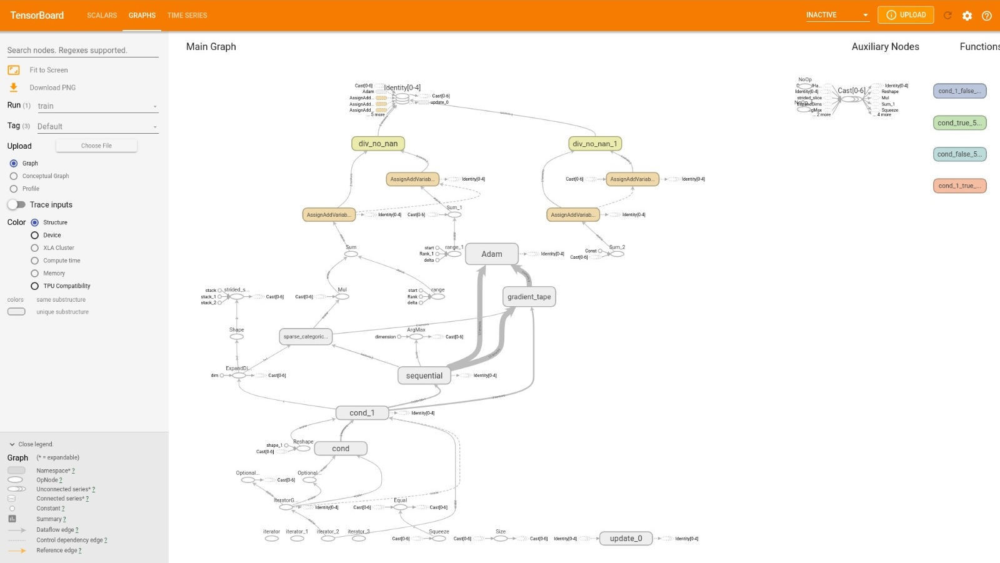

# podman-nvidia-tensorRT-cuda-opencl-tensorflow-2.6.0-gpu-jupyter
The test results with the latest TensorFlow-2.6.0 local build with the latest Nvidia Tensor RT 8.0.1.6 running on the old GPU with capability 5.0 look promising.
Previously created docker with the latest Nvidia CUDA SDK 11.4 and cuDNN 8.2.2 was used for the build, took more than 4.5 hours, probably due to capabilities chosen [5.0, 6.1, 7.5, 8.0, 8.6] to cover K620, GTX1080ti, RTX2080, A100 and RTX3090 respectively.
The Jupyter execution results of the example distributed training keras.ipynb are below as well as screenshots from the tensorboard. Tested with Podman on Fedora 33 only with sudo, the next step is to try tensorflow_cc and test it root-less (no sudo) via Podman on Fedora 34 with auto-start of the container that exposes a port for SSH access.






##### Copyright 2019 The TensorFlow Authors.


```python
#@title Licensed under the Apache License, Version 2.0 (the "License");
# you may not use this file except in compliance with the License.
# You may obtain a copy of the License at
#
# https://www.apache.org/licenses/LICENSE-2.0
#
# Unless required by applicable law or agreed to in writing, software
# distributed under the License is distributed on an "AS IS" BASIS,
# WITHOUT WARRANTIES OR CONDITIONS OF ANY KIND, either express or implied.
# See the License for the specific language governing permissions and
# limitations under the License.
```

# Distributed training with Keras

<table class="tfo-notebook-buttons" align="left">
  <td>
    <a target="_blank" href="https://www.tensorflow.org/tutorials/distribute/keras">View on TensorFlow.org</a>
  </td>
  <td>
    <a target="_blank" href="https://colab.research.google.com/github/tensorflow/docs/blob/master/site/en/tutorials/distribute/keras.ipynb">Run in Google Colab</a>
  </td>
  <td>
    <a target="_blank" href="https://github.com/tensorflow/docs/blob/master/site/en/tutorials/distribute/keras.ipynb">View source on GitHub</a>
  </td>
  <td>
    <a href="https://storage.googleapis.com/tensorflow_docs/docs/site/en/tutorials/distribute/keras.ipynb">Download notebook</a>
  </td>
</table>

## Overview

The `tf.distribute.Strategy` API provides an abstraction for distributing your training
across multiple processing units. The goal is to allow users to enable distributed training using existing models and training code, with minimal changes.

This tutorial uses the `tf.distribute.MirroredStrategy`, which
does in-graph replication with synchronous training on many GPUs on one machine.
Essentially, it copies all of the model's variables to each processor.
Then, it uses [all-reduce](http://mpitutorial.com/tutorials/mpi-reduce-and-allreduce/) to combine the gradients from all processors and applies the combined value to all copies of the model.

`MirroredStrategy` is one of several distribution strategy available in TensorFlow core. You can read about more strategies at [distribution strategy guide](../../guide/distributed_training.ipynb).


### Keras API

This example uses the `tf.keras` API to build the model and training loop. For custom training loops, see the [tf.distribute.Strategy with training loops](training_loops.ipynb) tutorial.

## Import dependencies


```python
# Import TensorFlow and TensorFlow Datasets

import tensorflow_datasets as tfds
import tensorflow as tf

import os
```


```python
print(tf.__version__)
```

    2.5.0


## Download the dataset

Download the MNIST dataset and load it from [TensorFlow Datasets](https://www.tensorflow.org/datasets). This returns a dataset in `tf.data` format.

Setting `with_info` to `True` includes the metadata for the entire dataset, which is being saved here to `info`.
Among other things, this metadata object includes the number of train and test examples. 


```python
datasets, info = tfds.load(name='mnist', with_info=True, as_supervised=True)

mnist_train, mnist_test = datasets['train'], datasets['test']
```

    Downloading and preparing dataset mnist/3.0.1 (download: 11.06 MiB, generated: 21.00 MiB, total: 32.06 MiB) to /root/tensorflow_datasets/mnist/3.0.1...


    WARNING:absl:Dataset mnist is hosted on GCS. It will automatically be downloaded to your
    local data directory. If you'd instead prefer to read directly from our public
    GCS bucket (recommended if you're running on GCP), you can instead pass
    `try_gcs=True` to `tfds.load` or set `data_dir=gs://tfds-data/datasets`.
    


    HBox(children=(HTML(value='Dl Completed...'), FloatProgress(value=0.0, max=4.0), HTML(value='')))


    
    
    Dataset mnist downloaded and prepared to /root/tensorflow_datasets/mnist/3.0.1. Subsequent calls will reuse this data.


## Define distribution strategy

Create a `MirroredStrategy` object. This will handle distribution, and provides a context manager (`tf.distribute.MirroredStrategy.scope`) to build your model inside.


```python
strategy = tf.distribute.MirroredStrategy()
```

    INFO:tensorflow:Using MirroredStrategy with devices ('/job:localhost/replica:0/task:0/device:GPU:0',)


    INFO:tensorflow:Using MirroredStrategy with devices ('/job:localhost/replica:0/task:0/device:GPU:0',)


```python
print('Number of devices: {}'.format(strategy.num_replicas_in_sync))
```

    Number of devices: 1


## Setup input pipeline

When training a model with multiple GPUs, you can use the extra computing power effectively by increasing the batch size. In general, use the largest batch size that fits the GPU memory, and tune the learning rate accordingly.


```python
# You can also do info.splits.total_num_examples to get the total
# number of examples in the dataset.

num_train_examples = info.splits['train'].num_examples
num_test_examples = info.splits['test'].num_examples

BUFFER_SIZE = 10000

BATCH_SIZE_PER_REPLICA = 64
BATCH_SIZE = BATCH_SIZE_PER_REPLICA * strategy.num_replicas_in_sync
```

Pixel values, which are 0-255, [have to be normalized to the 0-1 range](https://en.wikipedia.org/wiki/Feature_scaling). Define this scale in a function.


```python
def scale(image, label):
  image = tf.cast(image, tf.float32)
  image /= 255

  return image, label
```

Apply this function to the training and test data, shuffle the training data, and [batch it for training](https://www.tensorflow.org/api_docs/python/tf/data/Dataset#batch). Notice we are also keeping an in-memory cache of the training data to improve performance.


```python
train_dataset = mnist_train.map(scale).cache().shuffle(BUFFER_SIZE).batch(BATCH_SIZE)
eval_dataset = mnist_test.map(scale).batch(BATCH_SIZE)
```

## Create the model

Create and compile the Keras model in the context of `strategy.scope`.


```python
with strategy.scope():
  model = tf.keras.Sequential([
      tf.keras.layers.Conv2D(32, 3, activation='relu', input_shape=(28, 28, 1)),
      tf.keras.layers.MaxPooling2D(),
      tf.keras.layers.Flatten(),
      tf.keras.layers.Dense(64, activation='relu'),
      tf.keras.layers.Dense(10)
  ])

  model.compile(loss=tf.keras.losses.SparseCategoricalCrossentropy(from_logits=True),
                optimizer=tf.keras.optimizers.Adam(),
                metrics=['accuracy'])
```

## Define the callbacks


The callbacks used here are:

*   *TensorBoard*: This callback writes a log for TensorBoard which allows you to visualize the graphs.
*   *Model Checkpoint*: This callback saves the model after every epoch.
*   *Learning Rate Scheduler*: Using this callback, you can schedule the learning rate to change after every epoch/batch.

For illustrative purposes, add a print callback to display the *learning rate* in the notebook.


```python
# Define the checkpoint directory to store the checkpoints

checkpoint_dir = './training_checkpoints'
# Name of the checkpoint files
checkpoint_prefix = os.path.join(checkpoint_dir, "ckpt_{epoch}")
```


```python
# Function for decaying the learning rate.
# You can define any decay function you need.
def decay(epoch):
  if epoch < 3:
    return 1e-3
  elif epoch >= 3 and epoch < 7:
    return 1e-4
  else:
    return 1e-5
```


```python
# Callback for printing the LR at the end of each epoch.
class PrintLR(tf.keras.callbacks.Callback):
  def on_epoch_end(self, epoch, logs=None):
    print('\nLearning rate for epoch {} is {}'.format(epoch + 1,
                                                      model.optimizer.lr.numpy()))
```


```python
callbacks = [
    tf.keras.callbacks.TensorBoard(log_dir='./logs'),
    tf.keras.callbacks.ModelCheckpoint(filepath=checkpoint_prefix,
                                       save_weights_only=True),
    tf.keras.callbacks.LearningRateScheduler(decay),
    PrintLR()
]
```

## Train and evaluate

Now, train the model in the usual way, calling `fit` on the model and passing in the dataset created at the beginning of the tutorial. This step is the same whether you are distributing the training or not.


```python
model.fit(train_dataset, epochs=12, callbacks=callbacks)
```

    Epoch 1/12
    WARNING:tensorflow:From /tmpfs/src/tf_docs_env/lib/python3.6/site-packages/tensorflow/python/data/ops/multi_device_iterator_ops.py:601: get_next_as_optional (from tensorflow.python.data.ops.iterator_ops) is deprecated and will be removed in a future version.
    Instructions for updating:
    Use `tf.data.Iterator.get_next_as_optional()` instead.


    WARNING:tensorflow:From /tmpfs/src/tf_docs_env/lib/python3.6/site-packages/tensorflow/python/data/ops/multi_device_iterator_ops.py:601: get_next_as_optional (from tensorflow.python.data.ops.iterator_ops) is deprecated and will be removed in a future version.
    Instructions for updating:
    Use `tf.data.Iterator.get_next_as_optional()` instead.


    INFO:tensorflow:Reduce to /job:localhost/replica:0/task:0/device:CPU:0 then broadcast to ('/job:localhost/replica:0/task:0/device:CPU:0',).


    INFO:tensorflow:Reduce to /job:localhost/replica:0/task:0/device:CPU:0 then broadcast to ('/job:localhost/replica:0/task:0/device:CPU:0',).


    INFO:tensorflow:Reduce to /job:localhost/replica:0/task:0/device:CPU:0 then broadcast to ('/job:localhost/replica:0/task:0/device:CPU:0',).


    INFO:tensorflow:Reduce to /job:localhost/replica:0/task:0/device:CPU:0 then broadcast to ('/job:localhost/replica:0/task:0/device:CPU:0',).


    INFO:tensorflow:Reduce to /job:localhost/replica:0/task:0/device:CPU:0 then broadcast to ('/job:localhost/replica:0/task:0/device:CPU:0',).


    INFO:tensorflow:Reduce to /job:localhost/replica:0/task:0/device:CPU:0 then broadcast to ('/job:localhost/replica:0/task:0/device:CPU:0',).


    INFO:tensorflow:Reduce to /job:localhost/replica:0/task:0/device:CPU:0 then broadcast to ('/job:localhost/replica:0/task:0/device:CPU:0',).


    INFO:tensorflow:Reduce to /job:localhost/replica:0/task:0/device:CPU:0 then broadcast to ('/job:localhost/replica:0/task:0/device:CPU:0',).


    INFO:tensorflow:Reduce to /job:localhost/replica:0/task:0/device:CPU:0 then broadcast to ('/job:localhost/replica:0/task:0/device:CPU:0',).


    INFO:tensorflow:Reduce to /job:localhost/replica:0/task:0/device:CPU:0 then broadcast to ('/job:localhost/replica:0/task:0/device:CPU:0',).


    INFO:tensorflow:Reduce to /job:localhost/replica:0/task:0/device:CPU:0 then broadcast to ('/job:localhost/replica:0/task:0/device:CPU:0',).


    INFO:tensorflow:Reduce to /job:localhost/replica:0/task:0/device:CPU:0 then broadcast to ('/job:localhost/replica:0/task:0/device:CPU:0',).


    INFO:tensorflow:Reduce to /job:localhost/replica:0/task:0/device:CPU:0 then broadcast to ('/job:localhost/replica:0/task:0/device:CPU:0',).


    INFO:tensorflow:Reduce to /job:localhost/replica:0/task:0/device:CPU:0 then broadcast to ('/job:localhost/replica:0/task:0/device:CPU:0',).


    INFO:tensorflow:Reduce to /job:localhost/replica:0/task:0/device:CPU:0 then broadcast to ('/job:localhost/replica:0/task:0/device:CPU:0',).


    INFO:tensorflow:Reduce to /job:localhost/replica:0/task:0/device:CPU:0 then broadcast to ('/job:localhost/replica:0/task:0/device:CPU:0',).


      1/938 [..............................] - ETA: 0s - loss: 2.3083 - accuracy: 0.0156WARNING:tensorflow:From /tmpfs/src/tf_docs_env/lib/python3.6/site-packages/tensorflow/python/ops/summary_ops_v2.py:1277: stop (from tensorflow.python.eager.profiler) is deprecated and will be removed after 2020-07-01.
    Instructions for updating:
    use `tf.profiler.experimental.stop` instead.


    WARNING:tensorflow:From /tmpfs/src/tf_docs_env/lib/python3.6/site-packages/tensorflow/python/ops/summary_ops_v2.py:1277: stop (from tensorflow.python.eager.profiler) is deprecated and will be removed after 2020-07-01.
    Instructions for updating:
    use `tf.profiler.experimental.stop` instead.


    WARNING:tensorflow:Callbacks method `on_train_batch_end` is slow compared to the batch time (batch time: 0.0047s vs `on_train_batch_end` time: 0.0316s). Check your callbacks.


    WARNING:tensorflow:Callbacks method `on_train_batch_end` is slow compared to the batch time (batch time: 0.0047s vs `on_train_batch_end` time: 0.0316s). Check your callbacks.


    932/938 [============================>.] - ETA: 0s - loss: 0.1947 - accuracy: 0.9441
    Learning rate for epoch 1 is 0.0010000000474974513
    938/938 [==============================] - 4s 4ms/step - loss: 0.1939 - accuracy: 0.9442
    INFO:tensorflow:Reduce to /job:localhost/replica:0/task:0/device:CPU:0 then broadcast to ('/job:localhost/replica:0/task:0/device:CPU:0',).


    INFO:tensorflow:Reduce to /job:localhost/replica:0/task:0/device:CPU:0 then broadcast to ('/job:localhost/replica:0/task:0/device:CPU:0',).


    INFO:tensorflow:Reduce to /job:localhost/replica:0/task:0/device:CPU:0 then broadcast to ('/job:localhost/replica:0/task:0/device:CPU:0',).


    INFO:tensorflow:Reduce to /job:localhost/replica:0/task:0/device:CPU:0 then broadcast to ('/job:localhost/replica:0/task:0/device:CPU:0',).


    Epoch 2/12
    935/938 [============================>.] - ETA: 0s - loss: 0.0636 - accuracy: 0.9811
    Learning rate for epoch 2 is 0.0010000000474974513
    938/938 [==============================] - 2s 3ms/step - loss: 0.0634 - accuracy: 0.9812
    Epoch 3/12
    936/938 [============================>.] - ETA: 0s - loss: 0.0438 - accuracy: 0.9864
    Learning rate for epoch 3 is 0.0010000000474974513
    938/938 [==============================] - 2s 3ms/step - loss: 0.0439 - accuracy: 0.9864
    Epoch 4/12
    937/938 [============================>.] - ETA: 0s - loss: 0.0234 - accuracy: 0.9936
    Learning rate for epoch 4 is 9.999999747378752e-05
    938/938 [==============================] - 2s 3ms/step - loss: 0.0234 - accuracy: 0.9936
    Epoch 5/12
    932/938 [============================>.] - ETA: 0s - loss: 0.0204 - accuracy: 0.9948
    Learning rate for epoch 5 is 9.999999747378752e-05
    938/938 [==============================] - 3s 3ms/step - loss: 0.0204 - accuracy: 0.9948
    Epoch 6/12
    919/938 [============================>.] - ETA: 0s - loss: 0.0188 - accuracy: 0.9951
    Learning rate for epoch 6 is 9.999999747378752e-05
    938/938 [==============================] - 2s 3ms/step - loss: 0.0187 - accuracy: 0.9951
    Epoch 7/12
    921/938 [============================>.] - ETA: 0s - loss: 0.0172 - accuracy: 0.9960
    Learning rate for epoch 7 is 9.999999747378752e-05
    938/938 [==============================] - 2s 3ms/step - loss: 0.0171 - accuracy: 0.9960
    Epoch 8/12
    931/938 [============================>.] - ETA: 0s - loss: 0.0147 - accuracy: 0.9970
    Learning rate for epoch 8 is 9.999999747378752e-06
    938/938 [==============================] - 2s 3ms/step - loss: 0.0147 - accuracy: 0.9970
    Epoch 9/12
    938/938 [==============================] - ETA: 0s - loss: 0.0144 - accuracy: 0.9970
    Learning rate for epoch 9 is 9.999999747378752e-06
    938/938 [==============================] - 2s 3ms/step - loss: 0.0144 - accuracy: 0.9970
    Epoch 10/12
    924/938 [============================>.] - ETA: 0s - loss: 0.0143 - accuracy: 0.9971
    Learning rate for epoch 10 is 9.999999747378752e-06
    938/938 [==============================] - 2s 3ms/step - loss: 0.0142 - accuracy: 0.9971
    Epoch 11/12
    937/938 [============================>.] - ETA: 0s - loss: 0.0140 - accuracy: 0.9972
    Learning rate for epoch 11 is 9.999999747378752e-06
    938/938 [==============================] - 2s 3ms/step - loss: 0.0140 - accuracy: 0.9972
    Epoch 12/12
    923/938 [============================>.] - ETA: 0s - loss: 0.0139 - accuracy: 0.9973
    Learning rate for epoch 12 is 9.999999747378752e-06
    938/938 [==============================] - 2s 3ms/step - loss: 0.0139 - accuracy: 0.9973


    <tensorflow.python.keras.callbacks.History at 0x7f50a0d94780>


As you can see below, the checkpoints are getting saved.


```python
# check the checkpoint directory
!ls {checkpoint_dir}
```

    checkpoint		     ckpt_4.data-00000-of-00001
    ckpt_1.data-00000-of-00001   ckpt_4.index
    ckpt_1.index		     ckpt_5.data-00000-of-00001
    ckpt_10.data-00000-of-00001  ckpt_5.index
    ckpt_10.index		     ckpt_6.data-00000-of-00001
    ckpt_11.data-00000-of-00001  ckpt_6.index
    ckpt_11.index		     ckpt_7.data-00000-of-00001
    ckpt_12.data-00000-of-00001  ckpt_7.index
    ckpt_12.index		     ckpt_8.data-00000-of-00001
    ckpt_2.data-00000-of-00001   ckpt_8.index
    ckpt_2.index		     ckpt_9.data-00000-of-00001
    ckpt_3.data-00000-of-00001   ckpt_9.index
    ckpt_3.index


To see how the model perform, load the latest checkpoint and call `evaluate` on the test data.

Call `evaluate` as before using appropriate datasets.


```python
model.load_weights(tf.train.latest_checkpoint(checkpoint_dir))

eval_loss, eval_acc = model.evaluate(eval_dataset)

print('Eval loss: {}, Eval Accuracy: {}'.format(eval_loss, eval_acc))
```

    157/157 [==============================] - 1s 6ms/step - loss: 0.0393 - accuracy: 0.9864
    Eval loss: 0.03928377106785774, Eval Accuracy: 0.9864000082015991


To see the output, you can download and view the TensorBoard logs at the terminal.

```
$ tensorboard --logdir=path/to/log-directory
```


```python
!ls -sh ./logs
```

    total 4.0K
    4.0K train


## Export to SavedModel

Export the graph and the variables to the platform-agnostic SavedModel format. After your model is saved, you can load it with or without the scope.


```python
path = 'saved_model/'
```


```python
model.save(path, save_format='tf')
```

    WARNING:tensorflow:From /tmpfs/src/tf_docs_env/lib/python3.6/site-packages/tensorflow/python/training/tracking/tracking.py:111: Model.state_updates (from tensorflow.python.keras.engine.training) is deprecated and will be removed in a future version.
    Instructions for updating:
    This property should not be used in TensorFlow 2.0, as updates are applied automatically.


    WARNING:tensorflow:From /tmpfs/src/tf_docs_env/lib/python3.6/site-packages/tensorflow/python/training/tracking/tracking.py:111: Model.state_updates (from tensorflow.python.keras.engine.training) is deprecated and will be removed in a future version.
    Instructions for updating:
    This property should not be used in TensorFlow 2.0, as updates are applied automatically.


    WARNING:tensorflow:From /tmpfs/src/tf_docs_env/lib/python3.6/site-packages/tensorflow/python/training/tracking/tracking.py:111: Layer.updates (from tensorflow.python.keras.engine.base_layer) is deprecated and will be removed in a future version.
    Instructions for updating:
    This property should not be used in TensorFlow 2.0, as updates are applied automatically.


    WARNING:tensorflow:From /tmpfs/src/tf_docs_env/lib/python3.6/site-packages/tensorflow/python/training/tracking/tracking.py:111: Layer.updates (from tensorflow.python.keras.engine.base_layer) is deprecated and will be removed in a future version.
    Instructions for updating:
    This property should not be used in TensorFlow 2.0, as updates are applied automatically.


    INFO:tensorflow:Assets written to: saved_model/assets


    INFO:tensorflow:Assets written to: saved_model/assets


Load the model without `strategy.scope`.


```python
unreplicated_model = tf.keras.models.load_model(path)

unreplicated_model.compile(
    loss=tf.keras.losses.SparseCategoricalCrossentropy(from_logits=True),
    optimizer=tf.keras.optimizers.Adam(),
    metrics=['accuracy'])

eval_loss, eval_acc = unreplicated_model.evaluate(eval_dataset)

print('Eval loss: {}, Eval Accuracy: {}'.format(eval_loss, eval_acc))
```

    157/157 [==============================] - 1s 3ms/step - loss: 0.0393 - accuracy: 0.9864
    Eval loss: 0.03928377106785774, Eval Accuracy: 0.9864000082015991


Load the model with `strategy.scope`.


```python
with strategy.scope():
  replicated_model = tf.keras.models.load_model(path)
  replicated_model.compile(loss=tf.keras.losses.SparseCategoricalCrossentropy(from_logits=True),
                           optimizer=tf.keras.optimizers.Adam(),
                           metrics=['accuracy'])

  eval_loss, eval_acc = replicated_model.evaluate(eval_dataset)
  print ('Eval loss: {}, Eval Accuracy: {}'.format(eval_loss, eval_acc))
```

    157/157 [==============================] - 1s 4ms/step - loss: 0.0393 - accuracy: 0.9864
    Eval loss: 0.03928377106785774, Eval Accuracy: 0.9864000082015991


### Examples and Tutorials
Here are some examples for using distribution strategy with keras fit/compile:
1. [Transformer](https://github.com/tensorflow/models/blob/master/official/nlp/transformer/transformer_main.py) example trained using `tf.distribute.MirroredStrategy`
2. [NCF](https://github.com/tensorflow/models/blob/master/official/recommendation/ncf_keras_main.py) example trained using `tf.distribute.MirroredStrategy`.

More examples listed in the [Distribution strategy guide](../../guide/distributed_training.ipynb#examples_and_tutorials)

## Next steps

* Read the [distribution strategy guide](../../guide/distributed_training.ipynb).
* Read the [Distributed Training with Custom Training Loops](training_loops.ipynb) tutorial.
* Visit the [Performance section](../../guide/function.ipynb) in the guide to learn more about other strategies and [tools](../../guide/profiler.md) you can use to optimize the performance of your TensorFlow models.

Note: `tf.distribute.Strategy` is actively under development and we will be adding more examples and tutorials in the near future. Please give it a try. We welcome your feedback via [issues on GitHub](https://github.com/tensorflow/tensorflow/issues/new).
